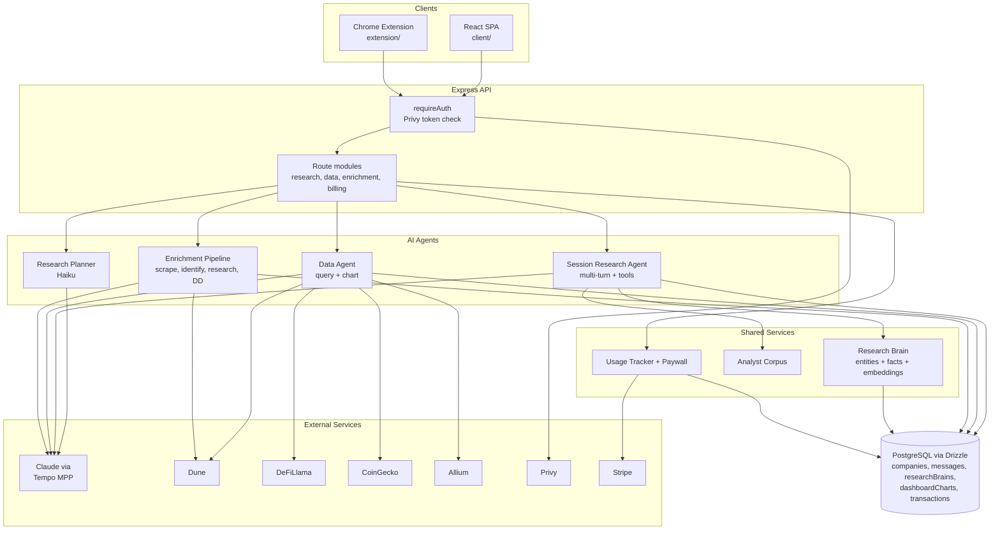
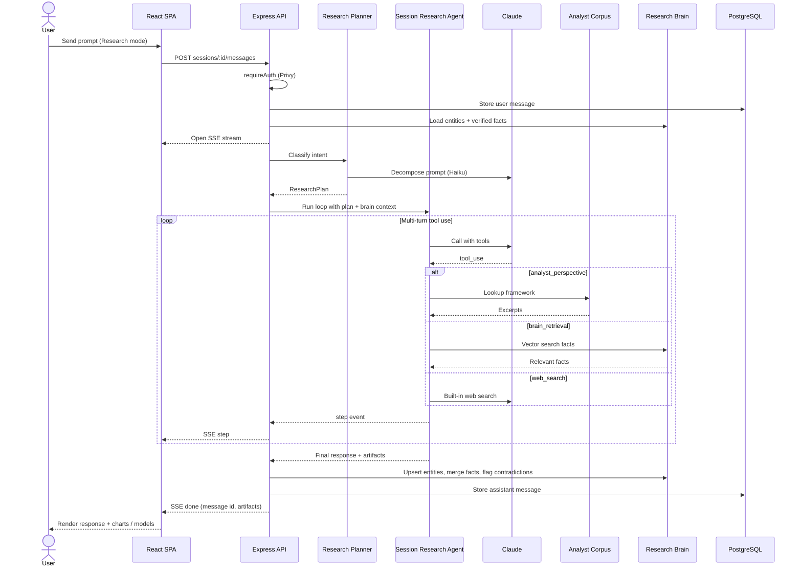
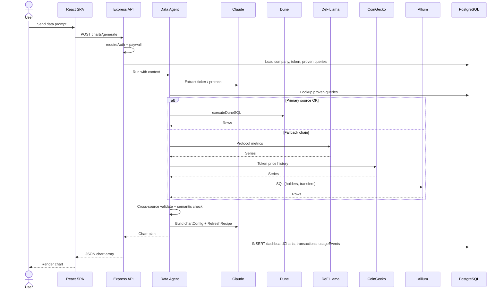
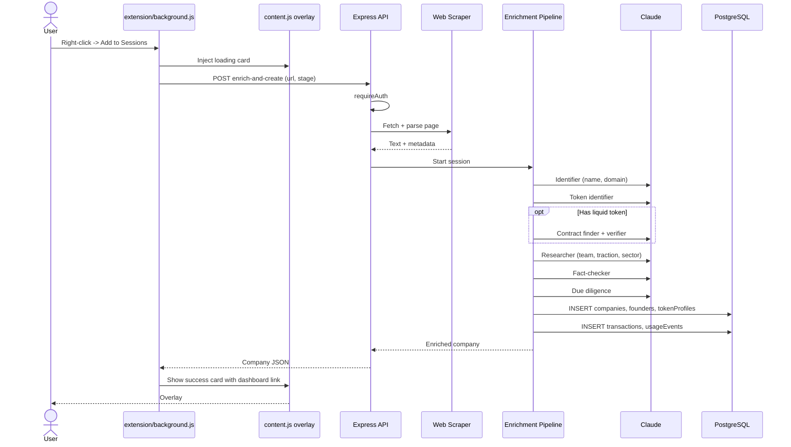

# Sessions

AI research platform for crypto investors and researchers.


## Overview

Sessions centralizes and enhances crypto research across projects, tokens, and
protocols. It transforms links, filings, and on-chain data into structured
intelligence: deal pipelines, AI-enriched company profiles, conversational
research agents with persistent memory, chart-building from multiple data
sources, and deep research reports. The platform learns from every session —
proven queries, runtime observations, and verified facts accumulate into a
persistent knowledge graph ("Research Brain") that makes subsequent research
progressively sharper.

The stack is a single full-stack TypeScript app: a React client, an Express
API server, a shared Drizzle schema over PostgreSQL, and a companion Chrome
extension for one-click deal capture from any web page. AI work is driven by
Anthropic Claude through Tempo's MPP proxy; authentication is handled by
Privy with embedded Tempo wallets.

## Key Features

- **Chrome extension** — right-click any link to send it to the enrichment
  pipeline and get a populated deal card back.
- **AI enrichment pipeline** — multi-step flow: web scrape → company/token
  identification → comprehensive research → fact-check → due-diligence notes.
- **Sessions conversational agent** — Research/Data mode toggle. Research mode
  runs a full multi-turn agent with brain context; Data mode routes to the Data
  Agent for fast chart building.
- **Data Agent** — generates custom charts over Dune SQL, DeFiLlama, CoinGecko,
  and Allium, with a self-learning query system, sanity checks, retries, and
  automatic source fallback.
- **Data Station** (`/station`) — saved-chart dashboard with named collections
  and bulk refresh via `RefreshRecipe`.
- **Financial Model Viewer** — spreadsheet-style UI for saved models, with
  scenario analysis, CSV download, and Google Sheets export.
- **Deep research reports** — asynchronous multi-turn agent with an analyst
  corpus for multi-perspective debate.
- **Research Brain** — Obsidian-style knowledge graph of typed entities,
  relationships, and verified facts with provenance and contradiction detection.
- **Telegram bot** — deal sourcing via Grammy.
- **Stripe billing** — credits and subscription management.

## Tech Stack

**Frontend**
- React 18.3, TypeScript 5.6, Vite 7.3
- Tailwind CSS 3.4, shadcn/ui on Radix
- TanStack Query 5.60, Wouter 3.3
- Framer Motion, Recharts
- Server-Sent Events for real-time enrichment progress

**Backend**
- Express 5.0 on Node.js 20
- Drizzle ORM 0.39 over PostgreSQL
- `@anthropic-ai/sdk` 0.78 via Tempo MPP (`anthropic.mpp.tempo.xyz`)
- Privy (`@privy-io/node` 0.11, `@privy-io/react-auth` 3.18), Tempo chain 4217
- Stripe 20.4 with `stripe-replit-sync`
- Grammy 1.41 (Telegram), pdfkit 0.18, viem 2.47

**Build**
- Vite for the client (`dist/public`)
- esbuild for the server bundle (`dist/index.cjs`)

## Architecture

### System overview

The client and the Chrome extension both talk to a single Express API. Every
request is authenticated by verifying a Privy access token in `requireAuth`
(`server/auth.ts`). Route modules in `server/routes/` dispatch to specialised
agents that share three cross-cutting services: the **Research Brain**
(entities + verified facts + embeddings), the **Analyst Corpus** (crypto
analyst writings surfaced as a `analyst_perspective` tool), and the **Usage
Tracker** (writes `transactions` and `usageEvents`, enforces credit
paywalls). All AI calls are routed through Tempo's MPP proxy to Anthropic;
all persistence goes through Drizzle to PostgreSQL.



### Flow 1: Deep research session

Entry point: `POST /api/research/sessions/:id/messages` handled in
`server/routes/research-routes.ts`. The response is an SSE stream — the UI
receives `step`, `plan`, `mode`, and `done` events as the agent works. The
planner (`server/research-planner.ts`) classifies intent and decomposes the
prompt into a `ResearchPlan`; the Session Research Agent
(`server/session-research-agent.ts`) then runs a multi-turn loop with three
tools (`web_search`, `analyst_perspective`, `brain_retrieval`). Extracted
facts and entities are merged back into the Research Brain with
contradiction detection before the assistant message is persisted.



### Flow 2: Chart generation (Data mode)

Entry point: `POST /api/companies/:id/charts/generate` in
`server/routes/data-routes.ts`, gated by `dataChartPaywall` (credit check).
The Data Agent (`server/data-agent.ts`) extracts the ticker/protocol, looks
up proven queries for that entity, and tries data sources in order — Dune
SQL (`server/dune-client.ts`) first, with automatic fallback to DeFiLlama,
CoinGecko, or Allium. Results go through a cross-source sanity check; the
final chart plus a `RefreshRecipe` is saved to `dashboardCharts` so the
Data Station can refresh it later with one click.



### Flow 3: Deal capture via Chrome extension

Entry point: the context-menu handler in `extension/background.js` POSTs the
link to `/api/companies/enrich-and-create`
(`server/routes/enrichment-routes.ts`). The enrichment pipeline
(`server/enrichment.ts`) runs a sequence of Claude agents — identify the
entity, detect whether it has a liquid token, optionally find and verify the
contract, then run research, fact-check, and due-diligence passes. The
result is written to `companies` (plus `founders` and `tokenProfiles` where
applicable) and an overlay card is shown in the page.



## Project Structure

```
client/       React SPA — pages, components, hooks, API client
server/       Express API, route modules, AI agents, data-source clients
shared/       Drizzle schema + Zod validators shared by client and server
extension/    Manifest V3 Chrome extension (service worker, content, popup)
data/         Analyst corpus and research-planner templates
scripts/      Dev utilities (post-merge hook, corpus ingestion)
script/       Production build orchestration (esbuild + Vite)
```

## Getting Started

### Prerequisites

- Node.js 20
- PostgreSQL 16 (a Supabase instance works out of the box)

### Install

```bash
npm install
```

### Environment variables

Create a `.env` (or set them in your deployment's secret store). Values that
ship hard-coded in `.replit` are noted.

| Variable                 | Required        | Purpose                                           |
| ------------------------ | --------------- | ------------------------------------------------- |
| `DATABASE_URL`           | yes             | PostgreSQL connection string                      |
| `VITE_PRIVY_APP_ID`      | yes             | Privy auth app ID (exposed to the client)         |
| `PORT`                   | no (default `5000`) | HTTP port for the Express server             |
| `MPP_SERVER_WALLET_KEY`  | yes             | Wallet key used to sign Claude calls via Tempo MPP |
| `DUNE_API_KEY`           | Data Agent      | Dune Analytics API access                         |
| `STRIPE_API_KEY`         | billing         | Stripe secret key for credits/subscriptions       |
| `TELEGRAM_BOT_TOKEN`     | Telegram bot    | Grammy bot token for deal sourcing                |

### Database

```bash
npm run db:push
```

Pushes the Drizzle schema in `shared/schema.ts` to the database referenced by
`DATABASE_URL`. Re-run after any schema change.

### Run locally

```bash
npm run dev
```

Starts the Express server with Vite HMR on port 5000. Open
<http://localhost:5000>.

## Scripts

| Script             | Description                                           |
| ------------------ | ----------------------------------------------------- |
| `npm run dev`      | Dev server (Express + Vite middleware), port 5000     |
| `npm run build`    | Build client (`dist/public`) and server (`dist/index.cjs`) via `script/build.ts` |
| `npm start`        | Run the production bundle (`node dist/index.cjs`)     |
| `npm run check`    | TypeScript type-check (`tsc`)                         |
| `npm run db:push`  | Apply Drizzle schema to the configured PostgreSQL     |

## Chrome Extension

The `extension/` directory is a Manifest V3 Chrome extension that calls back
into the Sessions API. It wires up a context-menu item on every URL; picking
"Add to Sessions" sends the link to the enrichment pipeline and injects a
loading → success card on the page.

To load it locally:

1. Open `chrome://extensions`.
2. Enable **Developer mode**.
3. Click **Load unpacked** and select the `extension/` directory.
4. Make sure the Sessions server is reachable at the URL the extension
   targets (see `extension/background.js`).

## Deployment

The project is set up for Replit autoscale deployment (see `.replit`). The
pipeline runs `npm run build` to emit `dist/public` (client) and
`dist/index.cjs` (server), then starts with `npm run start`. Any Node 20
environment with a reachable PostgreSQL works the same way.

## Further Reading

- [`replit.md`](replit.md) — deeper product and system-architecture notes.
- [`HANDOFF.md`](HANDOFF.md) — AI agent evaluation and benchmark system.
- [`landing-page-design-system.md`](landing-page-design-system.md) — design tokens for the landing page.

## License

MIT.
